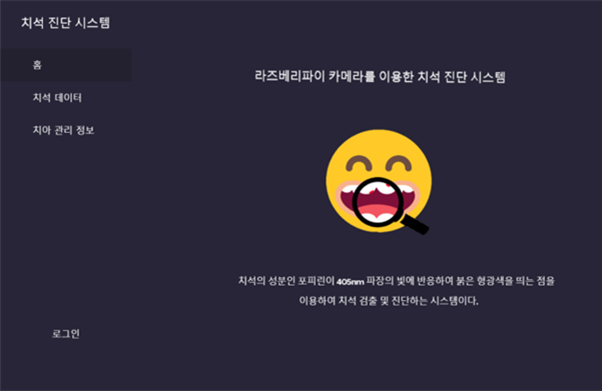
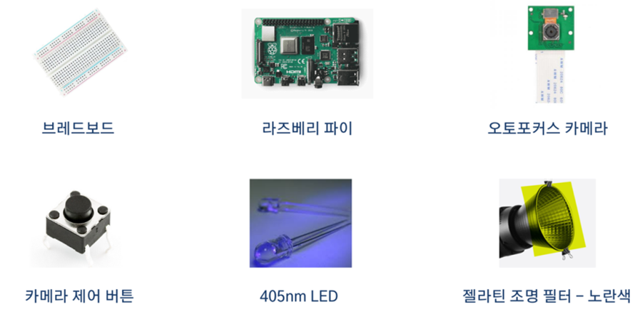
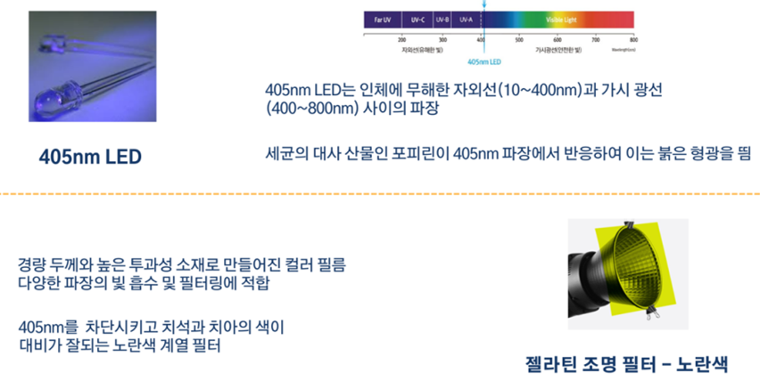
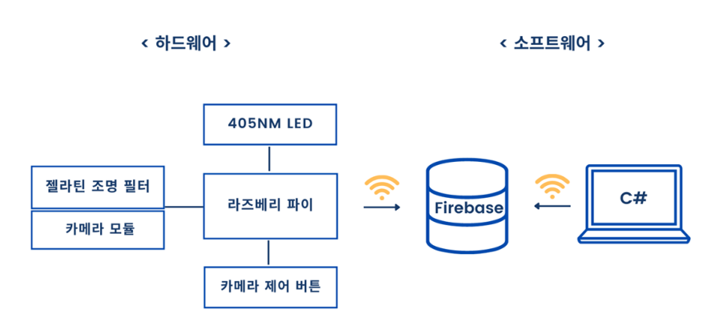
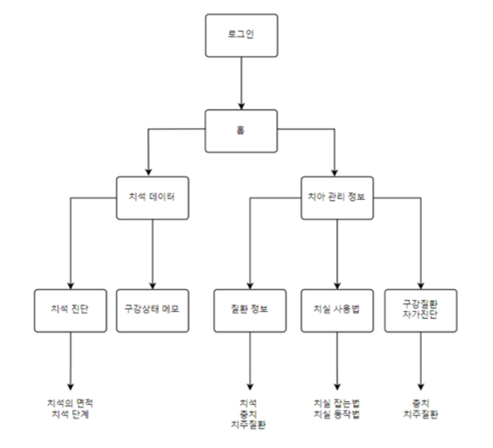
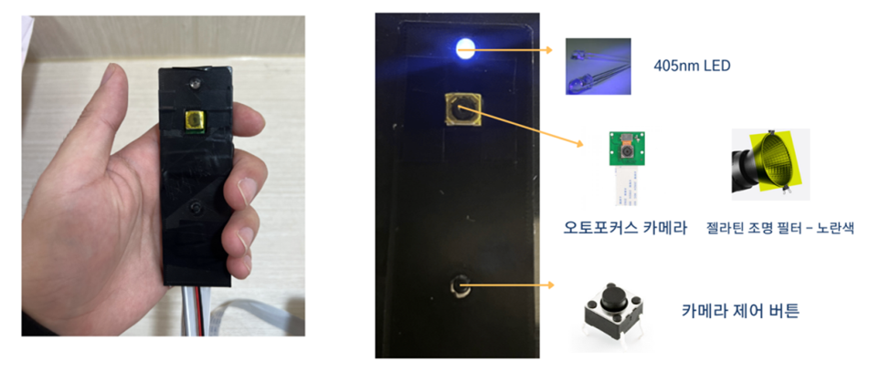

## [2022-02 설계및프로젝트기본II] 라즈베리파이를 이용한 치석 진단시스템
 

  

 

### 프로젝트 소개
- '정량 광유도 형광 검출법'에 의해 치석의 진행 단계를 진단할 수 있는 WPF 기반 애플리케이션입니다.
- 구강 이미지는 라즈베리파이의 카메라 모듈을 이용하여 촬영합니다.
- 2022년 한국전자통신학회지에 실린「형광 검출을 이용한 치석 진단 시스템 개발(정선희 외 2명)」논문을 참고하여 '정량 광유도 형광 검출법'을 구현했습니다.
- 제작 기간: 2022.10 ~ 2022.12 (약 3개월)
- 팀 구성(라즈베리파이 1명, 데이터베이스 1명, 프론트엔드 1명)
   
   

### 정량 광유도 형광 검출법
- 405nm의 빛을 치아에 조사한 후 카메라로 촬영했을 때 치아는 파란색, 치석은 붉은 형광색을 띄게 되는데, 치석의 성분인 포피린이 405nm 파장의 빛에 반응한다는 특징을 이용한 검출법입니다.
   
   

### 선행 논문과의 기능적 차별점
- 선행논문「형광 검출을 이용한 치석 진단 시스템 개발」에서는 스마트폰을 이용한 치석 진단 시스템을 구축했습니다. 이는 기종 별 카메라에 따라 색상차이와 오차값이 발생할 우려가 있어 본 프로젝트에서는 라즈베리파이의 카메라 모듈 도입과 DB 저장이 가능한 WPF 기반 애플리케이션 형태로 개발했습니다.
- 치석의 비율 및 단계 진단 기능을 개발했습니다. 특히 카메라 거리감에 따라 치아에 비율이 달라질 수 있으므로 '치아에 대한 치석의 비율'을 시스템 내에서 계산가능하도록 개발했습니다.     
 
 

### 프로젝트 필요성
- 치주질환은 다발생 질병 순위 1위에 이르나, 치과는 다른 영역에 비해 보험 적용이 적어 개인의 부담이 큽니다.
   따라서 지속적인 관리와 예방을 위해 가정 또는 학교에서 직접 치석을 진단할 수 있는 시스템을 개발했습니다.
   
   

   
### 개발 환경
- Front : C#, .NET, WPF, WindowForm
- DB : Firebase
- 버전 및 이슈관리 : Github
- 하드웨어 :
 

 
 

### 시스템 구성도
-하드웨어와 소프트웨어를 통합한 시스템 구성도입니다.

 
 

### 플로우 차트
-애플리케이션 기능으로 나눈 플로우 차트입니다.

 
 

### 제품 외형
- 3D 프린팅을 통해 카메라모듈 케이스를 제작했습니다.

 
 

### 향후 개선 사항
- 치석 단계 진단의 경우 공식적인 기준이 없어 미국 치과 홈페이지 출처의 치석 1 ~ 4 단계 사진을 근거로 임의로 비율을 나누어 단계 진단을 처리했습니다. 기준 확립에 대한 분명한 근거를 재정립할 필요가 있습니다.
- 치석 이미지 처리의 경우 치아, 잇몸, 치석 각각의 RGB값은 10여개의 사진에서 추출한 평균값으로 사용했습니다. 오차값에 대한 테스트와 정확한 데이터셋이 필요합니다.
- 치석 진단의 경우 이미지 처리 기능에 제약이 있어 WPF가 아닌 Window Form으로 개발되었습니다. 시스템 통일과 백엔드 구현이 개선되어야 합니다.
 
 
치석 진단 GitHub(Window Form) : https://github.com/sunnnycode/Tartar_ImageRGB

